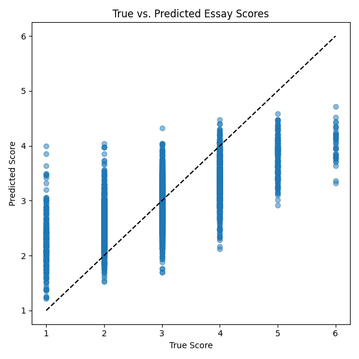
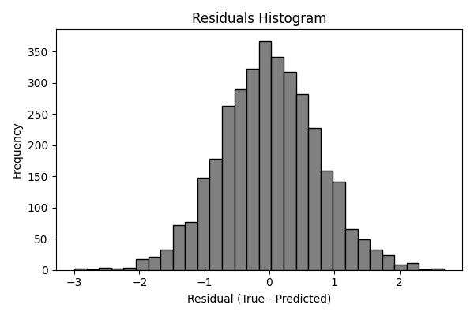
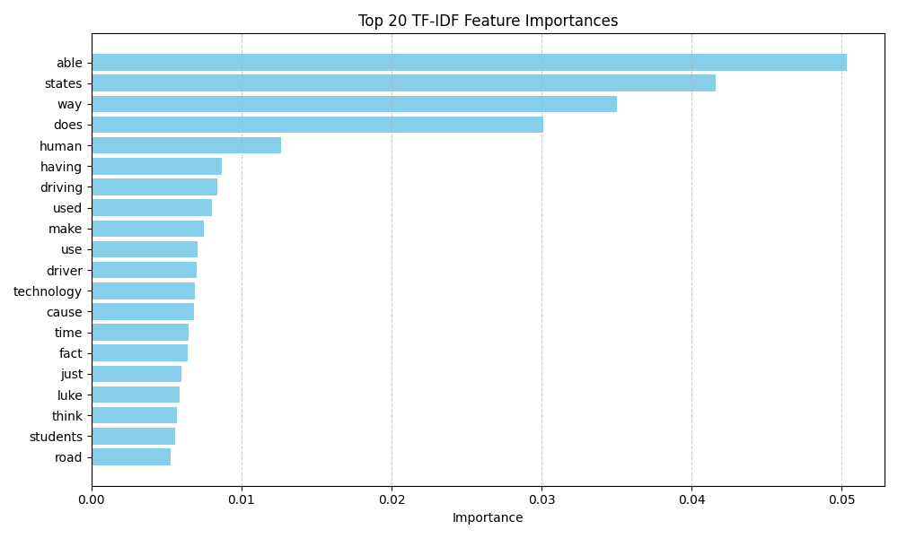

# Project Evaluation Report

## 1. Technical Implementation
- Used TF-IDF vectorizer and RandomForestRegressor from scikit-learn.

## 2. Model Performance
- **MSE**: 0.5679
- **RMSE**: 0.7536
- **MAE**: 0.5960
- **R2**: 0.4853
- **ExactMatch%**: 49.9711

**Plots:**

## 3. Documentation and Reporting
- This report details model design, data prep, evaluation metrics, and visuals.

## 4. Practical Relevance
- Streamlit UI available via `app.py` to grade essays interactively.
- Limitations: short essays (<50 words) may produce unstable scores.
- Future work: add retraining, explainability, and handle data drift.
